# Synexis Platform — Technical Architecture & Workflow Diagrams

This directory contains the official technical diagrams for **Synexis** (*Intelligent System Analysis and Automation Platform*).

All diagrams are provided in two formats:
1. **High-Resolution Vector SVG**: Stored directly in `docs/diagrams/*.svg` for presentations, reports, and publication.
2. **Standard Mermaid Markdown**: Native text definitions below for GitHub rendering and documentation.

---

## 1. System Architecture Diagram

Vector File: [`docs/diagrams/system-architecture.svg`](./system-architecture.svg)

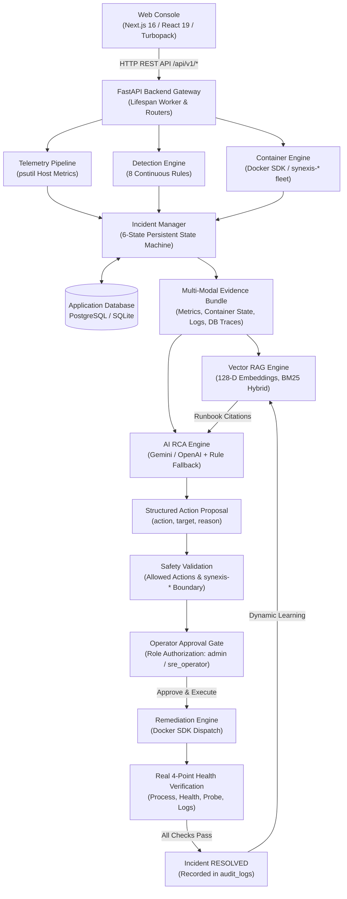

---

## 2. Docker Sandbox Cluster Diagram

Vector File: [`docs/diagrams/docker-sandbox.svg`](./docker-sandbox.svg)

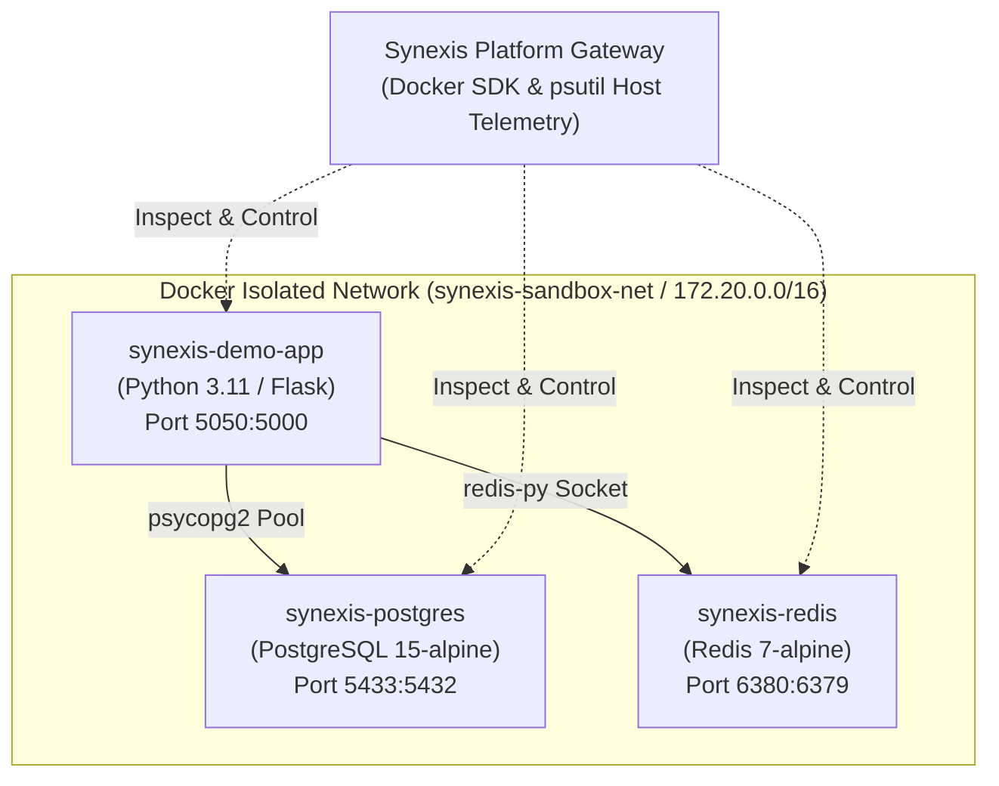

---

## 3. Complete 14-Stage Operational Workflow

Vector File: [`docs/diagrams/workflow.svg`](./workflow.svg)

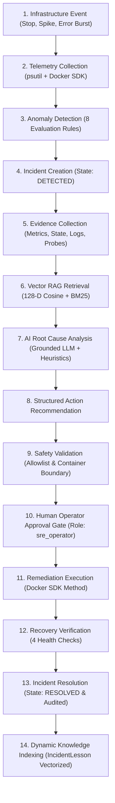

---

## 4. Incident Lifecycle State Machine

Vector File: [`docs/diagrams/incident-lifecycle.svg`](./incident-lifecycle.svg)

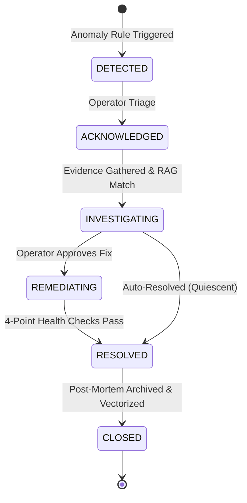

---

## 5. Vector RAG Architecture

Vector File: [`docs/diagrams/rag-architecture.svg`](./rag-architecture.svg)

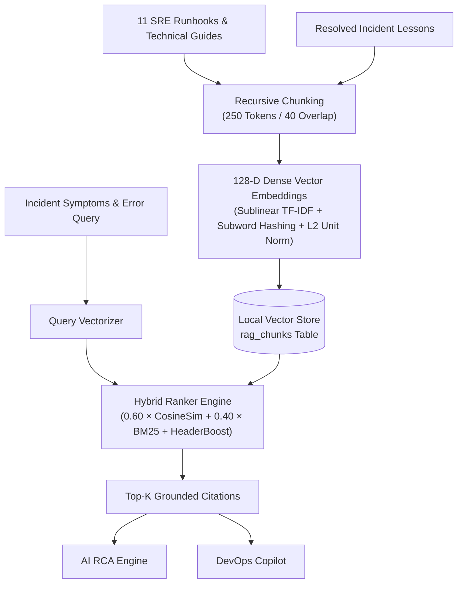

---

## 6. Multi-Modal AI RCA Flow

Vector File: [`docs/diagrams/ai-rca.svg`](./ai-rca.svg)

```mermaid
graph LR
    subgraph Inputs ["Multi-Modal Evidence"]
        E1["Host Compute Metrics"]
        E2["Docker Container State"]
        E3["Error Log Traces"]
        E4["RAG Runbook Citations"]
    end
    
    Inputs --> AI["AI Diagnostic Engine<br/>(Gemini / OpenAI + Rule Fallback)"]
    
    subgraph Output ["Structured JSON Schema"]
        O1["root_cause: str"]
        O2["confidence: int (0-100)"]
        O3["evidence: list[str]"]
        O4["recommendation: str"]
        O5["structured_actions: list[Action]"]
        O6["rag_sources: list[Citation]"]
    end
    
    AI --> Output
```

---

## 7. Safe Human-in-the-Loop Remediation

Vector File: [`docs/diagrams/remediation.svg`](./remediation.svg)

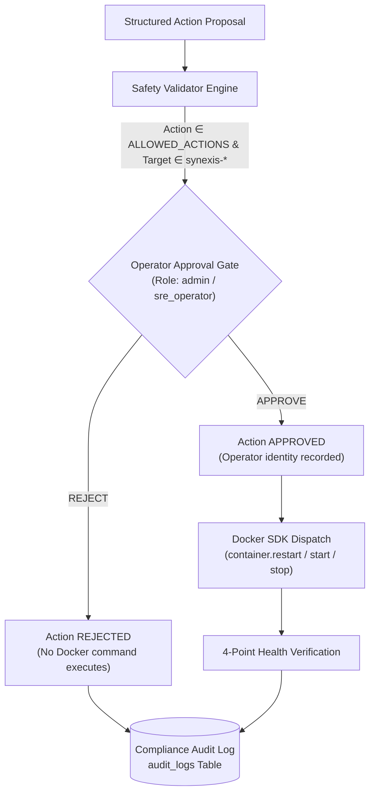

---

## 8. Real 4-Point Health Verification

Vector File: [`docs/diagrams/verification.svg`](./verification.svg)

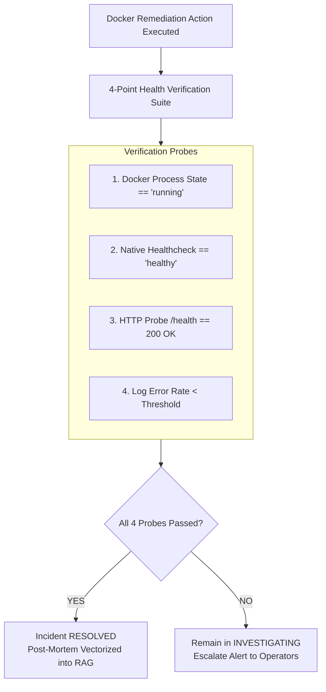

---

## 9. End-to-End Data Flow

Vector File: [`docs/diagrams/data-flow.svg`](./data-flow.svg)

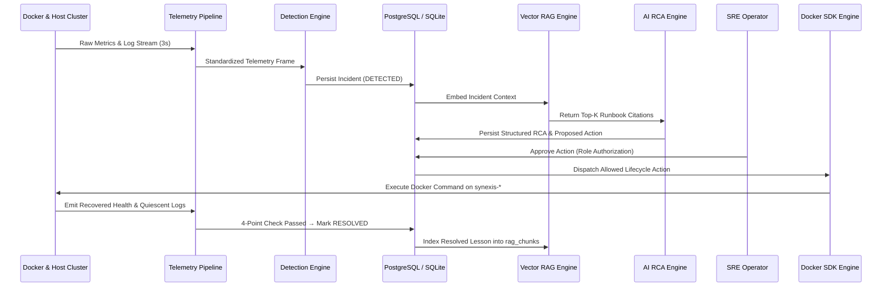

---

## 10. Technology Stack Diagram

Vector File: [`docs/diagrams/technology-stack.svg`](./technology-stack.svg)

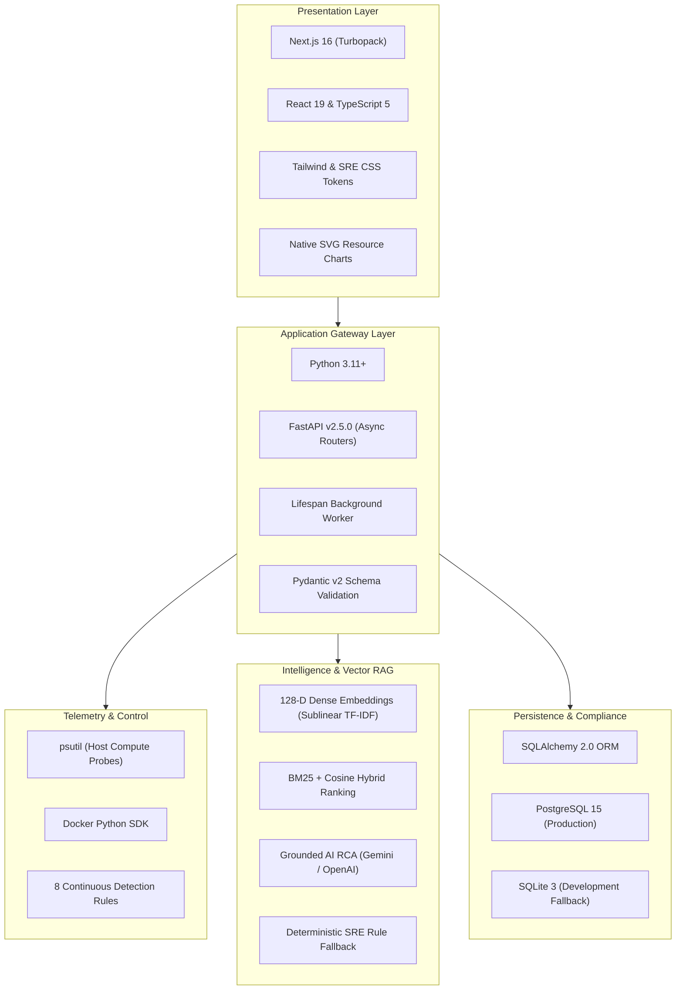

---

## 11. Multi-Provider Infrastructure Architecture

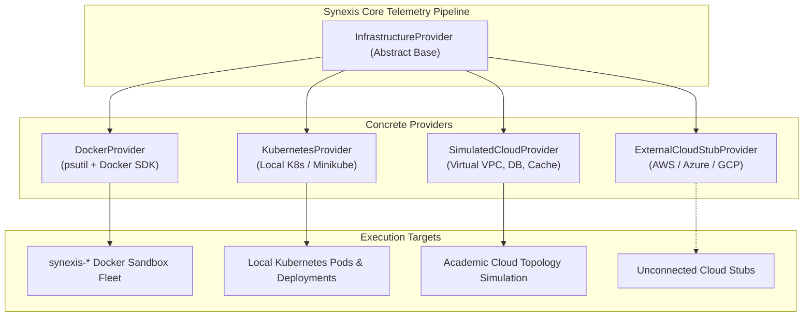

---

## 12. Configuration Artifact Generation & Operator Review Lifecycle

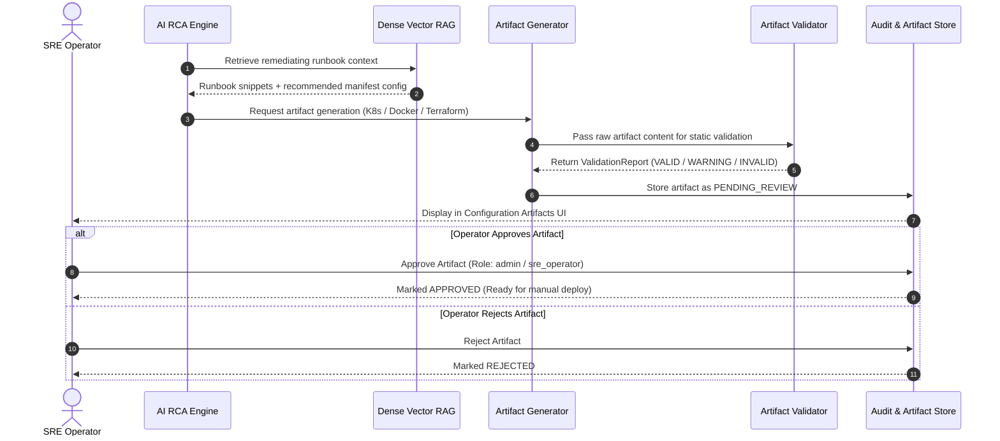

